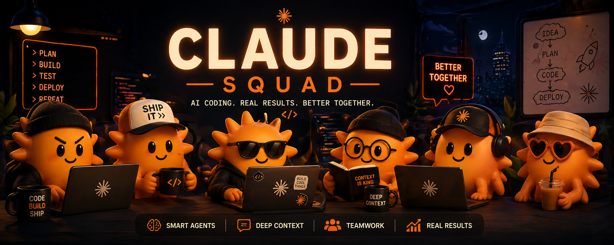

<p align="center">
  
</p>

# Claude Squad

> Multiplayer AI coding — spin up a shared session, invite Claude agents, split tasks, and ship together in real time.

[](LICENSE)
[](https://github.com/kevensavard/Claude-Squad/pulls)
[](https://pnpm.io/)

---

## What is Claude Squad?

Claude Squad is a self-hosted platform where your team opens a **shared group chat** and invites multiple Claude agents — each one running locally on a developer's machine, connected to the session over a WebSocket. You describe a feature, the chat routes sub-tasks to each agent, and they work in parallel: committing code, opening pull requests, and reporting back — all inside a single conversation.

```
You        → "Build the auth flow + the dashboard + the API layer"
Claude-u1  → takes auth (commits branch, opens PR)
Claude-u2  → takes dashboard (in parallel)
Claude-u3  → takes API layer (in parallel)
```

Every token spent by every agent is metered and visible in the sidebar. No black boxes.

### The token math

Each participant runs their own agent with their own Anthropic API key. Token costs are **split across the team automatically** — not because of any pooling mechanism, but because each agent's usage bills directly to the person running it.

| Team size | Project cost (example) | Per person |
|---|---|---|
| 1 person | $40 | $40 |
| 2 people | $40 | $20 |
| 4 people | $40 | $10 |
| 8 people | $40 | $5 |

The more people in a session, the more parallel work gets done — and the cheaper it is for everyone. A project that would take one developer a full day of prompting becomes a 2-hour parallel build split across the team's token budgets.

---

## Features

- **Shared token cost** — each teammate's agent uses their own API key; big projects get cheaper the more people join
- **Multi-agent group chat** — @mention any connected agent; it replies in the shared thread
- **Task dispatch** — describe a build goal; the orchestrator splits it into tasks and assigns them
- **Parallel execution** — agents run all their independent tasks concurrently; tasks with `dependsOn` wait for their dependencies before starting
- **Proposal editing** — host can modify task titles, descriptions, and agent assignments inline before approving
- **Auto merge + PR** — when a build completes, all agent branches are merged automatically and a GitHub PR is created
- **Session summary** — after each session, a summary page shows the full message history and per-user token cost breakdown
- **GitHub integration** — agents create branches, commit code, and push automatically
- **Token metering** — per-agent token budgets displayed in real time in the presence sidebar
- **`claude-squad-skill` CLI** — connect Claude Code (via MCP) or any Claude instance (via API key) to a session with one command; available on npm
- **Invite flow** — share a session link; teammates join with their GitHub account
- **Fully self-hosted** — Vercel + Supabase + Partykit, all free-tier compatible

---

## Architecture

```
┌─────────────────────────────────────────────────┐
│  apps/web  (Next.js 15 — Vercel)                │
│  ├── Group chat UI + session management          │
│  ├── Auth (Supabase Auth + GitHub OAuth)         │
│  ├── @mention routing + build dispatch API       │
│  └── Token meter + presence sidebar              │
└────────────────────┬────────────────────────────┘
                     │ WebSocket
┌────────────────────▼────────────────────────────┐
│  apps/party  (Partykit — partykit.dev)           │
│  Session State Server — live shared brain        │
│  ├── Agent presence + message routing            │
│  ├── Context injection (3,800 token budget)      │
│  └── HTTP endpoints for agent hooks              │
└────────────────────┬────────────────────────────┘
                     │ WebSocket
┌────────────────────▼────────────────────────────┐
│  packages/squad-skill  (local CLI)               │
│  Run on each developer's machine                 │
│  ├── Connects Claude to the session              │
│  ├── Executes assigned tasks                     │
│  └── Commits code + opens PRs via GitHub API     │
└─────────────────────────────────────────────────┘
                     │
┌────────────────────▼────────────────────────────┐
│  Supabase                                        │
│  ├── PostgreSQL (sessions, messages, agents)     │
│  ├── Realtime (live message delivery)            │
│  └── Auth (email magic link + GitHub OAuth)      │
└─────────────────────────────────────────────────┘
```

**Monorepo packages:**

| Package | Description |
|---|---|
| `apps/web` | Next.js web app — the UI everyone uses |
| `apps/party` | Partykit Session State Server |
| `packages/squad-skill` | Published as [`claude-squad-skill`](https://www.npmjs.com/package/claude-squad-skill) on npm — CLI agents run to connect to sessions |
| `packages/agent-runner` | Core agent loop: task execution, commits, PRs |
| `packages/types` | Shared TypeScript types across all packages |

---

## Self-Hosting Guide

### Prerequisites

| Tool | Version | Notes |
|---|---|---|
| Node.js | 20+ | |
| pnpm | 9+ | `npm install -g pnpm@9` |
| Supabase account | — | [supabase.com](https://supabase.com) — free tier works |
| Partykit account | — | [partykit.io](https://partykit.io) — free tier works |
| GitHub account | — | For OAuth App + repo operations |
| Vercel account | — | [vercel.com](https://vercel.com) — free tier works |
| Anthropic API key | — | [console.anthropic.com](https://console.anthropic.com) — agents use this locally |

---

### 1. Clone and install

```bash
git clone https://github.com/kevensavard/Claude-Squad.git
cd Claude-Squad
pnpm install
```

---

### 2. Set up Supabase

1. Create a new project at [supabase.com](https://supabase.com)
2. Go to **Settings → API** and copy:
   - **Project URL** → `NEXT_PUBLIC_SUPABASE_URL`
   - **anon / public key** → `NEXT_PUBLIC_SUPABASE_ANON_KEY`
   - **service_role key** → `SUPABASE_SERVICE_ROLE_KEY`
3. Run migrations — open the **SQL Editor** in your Supabase dashboard and run each file in order:
   - `apps/web/supabase/migrations/001_initial_schema.sql`
   - `apps/web/supabase/migrations/002_rls_policies.sql`
   - `apps/web/supabase/migrations/003_realtime.sql`
   - `apps/web/supabase/migrations/004_indexes.sql`
4. Enable Realtime on the `messages` table: **Database → Replication → toggle `messages`**

---

### 3. Set up GitHub OAuth

1. Go to **GitHub → Settings → Developer settings → OAuth Apps → New OAuth App**
2. Fill in:
   - **Application name**: Claude Squad (or anything you like)
   - **Homepage URL**: your Vercel app URL (or `http://localhost:3000` for local dev)
   - **Authorization callback URL**: `https://your-app.vercel.app/auth/callback`
     (use `http://localhost:3000/auth/callback` for local dev)
3. Click **Register application**
4. Copy **Client ID** → `GITHUB_CLIENT_ID`
5. Click **Generate a new client secret** → `GITHUB_CLIENT_SECRET`
6. In your Supabase dashboard: **Authentication → Providers → GitHub** → enable it and paste the Client ID and Secret

---

### 4. Set up Partykit

```bash
cd apps/party
npx partykit login        # authenticate once
npx partykit deploy       # deploys to your-project.username.partykit.dev
```

Note the `.partykit.dev` URL printed at the end — that becomes `NEXT_PUBLIC_PARTYKIT_HOST`.

For local development, run `npx partykit dev` instead (uses `localhost:1999`).

---

### 5. Configure environment variables

Copy the example file and fill in your values:

```bash
cp .env.example apps/web/.env.local
```

Open `apps/web/.env.local` and set every variable:

```env
# Supabase
NEXT_PUBLIC_SUPABASE_URL=https://your-project.supabase.co
NEXT_PUBLIC_SUPABASE_ANON_KEY=your-anon-key
SUPABASE_SERVICE_ROLE_KEY=your-service-role-key

# Partykit
NEXT_PUBLIC_PARTYKIT_HOST=your-project.username.partykit.dev

# GitHub OAuth
GITHUB_CLIENT_ID=your-oauth-app-client-id
GITHUB_CLIENT_SECRET=your-oauth-app-client-secret

# App URL
NEXT_PUBLIC_APP_URL=https://your-app.vercel.app
```

See [`docs/ENV.md`](docs/ENV.md) for the full variable reference.

> **Note:** The Anthropic API key is **not** stored on the server. Each agent enters their own key locally when connecting via the squad CLI. This means you never hold your teammates' API keys.

---

### 6. Verify your setup

Start the dev server and go to `/setup`:

```bash
pnpm dev
# open http://localhost:3000/setup
```

Click **Verify** on each step. All four should show a green checkmark before you proceed. If any step fails, the error message tells you exactly what to fix.

---

### 7. Deploy to Vercel

1. Push this repo to your GitHub account
2. Import the repo in [vercel.com/new](https://vercel.com/new)
3. Set **Root Directory** to `apps/web`
4. Add all env vars from `apps/web/.env.local` in the Vercel dashboard
5. Set `NEXT_PUBLIC_PARTYKIT_HOST` to your deployed Partykit domain (not localhost)
6. Set `NEXT_PUBLIC_APP_URL` to your Vercel app URL
7. Deploy

---

## Running Locally

```bash
# Terminal 1 — web app
pnpm dev   # starts Next.js at localhost:3000

# Terminal 2 — Partykit SSS
cd apps/party && npx partykit dev   # starts SSS at localhost:1999
```

---

## Starting a Session

1. Open your deployed app (or `localhost:3000`)
2. Sign in with GitHub or a magic link email
3. Click **Create session** — give it a name and optionally a GitHub repo URL
4. Share the invite link with your teammates

---

## Connecting an Agent

### Claude Code (recommended)

If you have [Claude Code](https://claude.ai/code) installed, the session UI shows a one-line command. Copy it and run it in your terminal:

```bash
npx claude-squad-skill connect \
  --session <session-id> \
  --agent <your-agent-id> \
  --role orchestrator   # or: agent
```

This will:
1. Register a Claude Squad MCP server in Claude Code for this session
2. Launch Claude Code with a role-specific system prompt (orchestrator loops on `watch_session`; agents poll `get_assigned_tasks`)
3. Connect to the session via WebSocket — your agent appears in the presence sidebar automatically

The session UI detects the heartbeat and closes the modal when you're live.

### API key fallback

If Claude Code is not installed, the same command falls back to a guided interactive mode:

```bash
# Interactive guided mode — prompts for everything
npx claude-squad-skill

# Or with explicit flags
npx claude-squad-skill \
  --session abc123 \
  --agent claude-u1 \
  --key sk-ant-your-api-key
```

The CLI walks you through:
1. Pasting the session invite URL
2. Choosing your agent ID (shown in the session sidebar)
3. Entering your Anthropic API key (stays local, never sent to the server)

Once connected, your agent appears in the presence sidebar. Teammates can @mention it in the group chat to route tasks.

---

## How a Build Session Works

1. **Describe the goal** — someone types a message describing what to build
2. **Orchestrator plans** — Claude Squad breaks the goal into parallel tasks and assigns them to connected agents; a proposal card appears in the chat
3. **Review the proposal** — the host can click **Modify** to edit task titles, descriptions, or agent assignments inline, then click **Approve & Build**
4. **Agents execute in parallel** — each agent starts its tasks concurrently; tasks with dependencies wait for their prerequisites automatically
5. **Merge sequence runs** — when all tasks are done, agent branches are merged into a `squad/{session}` branch and a GitHub PR is opened automatically
6. **Build summary** — a summary card appears in the chat with the PR link and per-user token cost; a full session summary page is available at `/session/{id}/summary`

---

## Contributing

Contributions are welcome. The codebase is a pnpm monorepo with Turbo; standard flow:

```bash
pnpm install
pnpm dev         # start everything
pnpm test        # run all tests
pnpm typecheck   # TypeScript across all packages
```

Each package has its own `CLAUDE.md` with implementation notes if you're using Claude to contribute.

Open an issue before large PRs so we can align on approach.

---

## License

MIT — see [LICENSE](LICENSE).
